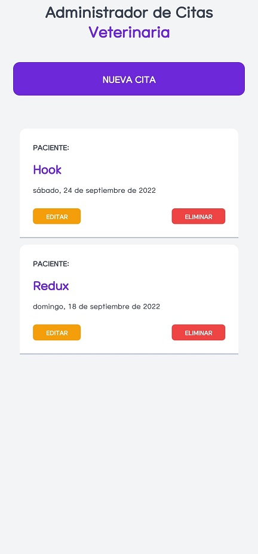

# Administrador de Citas Veterinaria

## Proyecto de React Native con Hooks de UseState y UseEffect

Proyecto del curso de React Native de Juan Pablo de la torre Valdez en Udemy

### Curso:

[React Native - Crea aplicaciones para Android y iOS c/ React](https://www.udemy.com/course/react-native-crea-aplicaciones-para-android-y-ios-con-react/)
